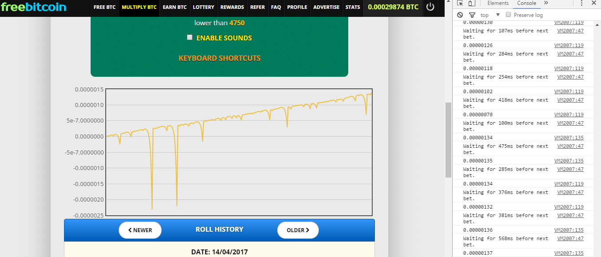
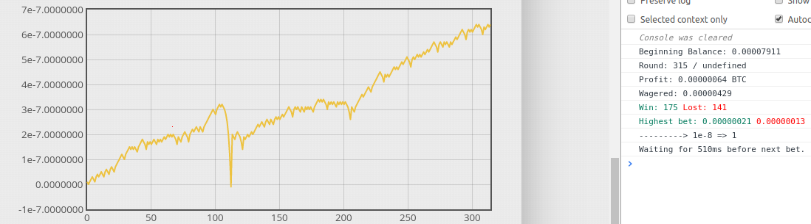

# FreeBotCoin
**Multiply mode**

**Fibonacci mode**

> **Suports:**
> - Chart.
> - Sites: FreeBitco.in, 999dice.com (for a while).
> - Two betting modes: Multply e Fibonacci.

> **Will supports:**
> - Chart improved.
> - Other betting sites like: primeDice and others.
> - Several ways to bet like: fibonacci, Martingale, Labouchere and others.
> - Menu.

## How to use
Follow these general steps to proceed:

Navigate to supported websites and:
* Create an account if you don't already have one
* Sign in
* Right click anywhere on the site -> choose "inspect element" -> go to "console" tab
* Paste the script into the console and hit enter
